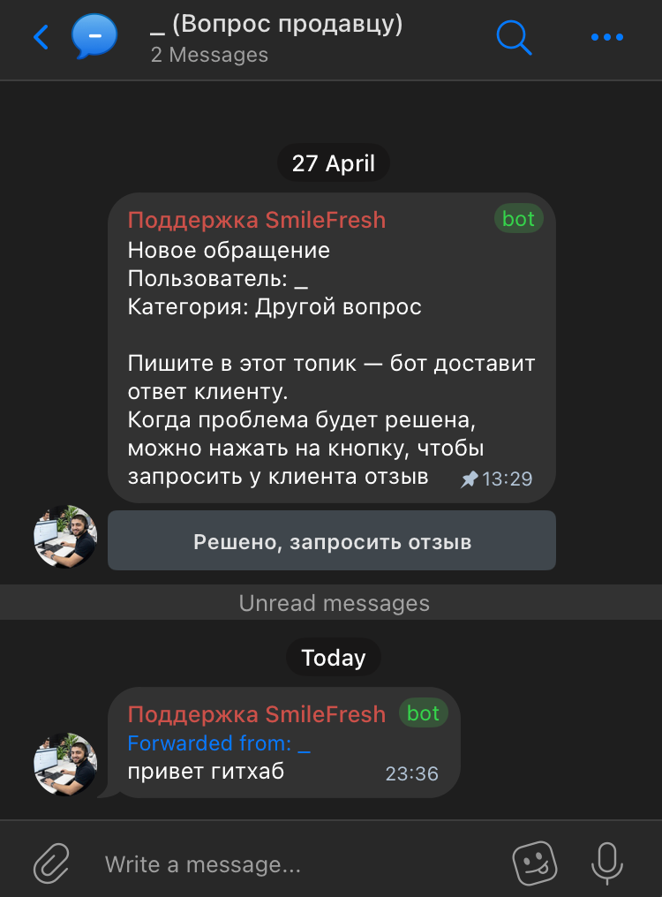
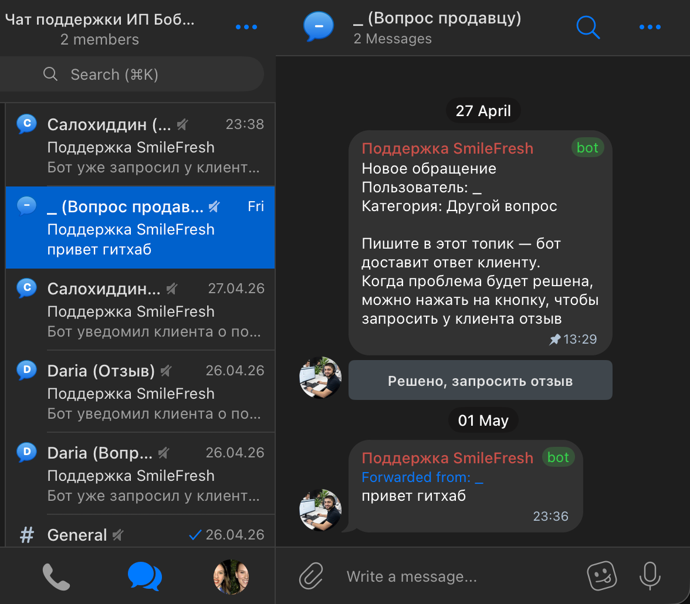

# MPQR Telegram Bot

<p>
  
</p>

A minimalist Telegram bot for:

- customer support in a topic-based manager group;
- review request and validation flow;
- reward delivery after manager approval.

## Stack

- `Python 3.13+`
- `aiogram 3`
- `aiogram-dialog`
- `uv`
- `SQLite (aiosqlite)`
- `loguru`
- Docker / Docker Compose

## Core Flow

- `/start` -> main menu (`Получить подарок` / `Написать продавцу`)
- Support flow:
  - category selection;
  - user messages are forwarded into a manager topic;
  - manager replies are relayed back to the user;
  - manager can click `Решено, запросить отзыв`.
- Review & reward flow:
  - phone request (text input or `share contact`);
  - phone confirmation;
  - review screenshot upload;
  - manager actions: `Бонус отправлен` / `Отклонить`;
  - user receives final status.

## Demo

Client (user) chat:

<p>
  
</p>

Manager (topics) chat:

<p>
  
</p>

## Commands

- `/start` — главное меню
- `/help` — прямой вход в поддержку
- `/review` — прямой вход в reward-for-review flow

## Quick Start (Local)

```bash
cp .env.examples .env
# fill .env
uv sync
uv run -m app.main
```

## Run with Docker

```bash
docker compose up -d --build
```

## Config (`.env`)

Required variables:

- `TG_BOT_TOKEN`
- `MANAGERS_GROUP_ID` (forum supergroup, usually `-100...`)

Optional:

- `BOT_USERNAME`
- `SQLITE_PATH`
- `LOG_LEVEL`
- `TZ`

## Project Structure

```text
app/
  main.py
  config.py
  context.py
  db.py
  keyboards.py
  states.py
  texts.py
  validators.py
  telegram_safe.py
  handlers/
    user.py
    manager.py
```

## Reliability

- state and business milestones are persisted in SQLite;
- Telegram API calls are wrapped with a safe-wrapper + retry for temporary network/flood issues;
- blocked user / bad request scenarios are handled without crashing the whole process.

## License

This project is licensed under [GNU AGPL-3.0](./LICENSE).
